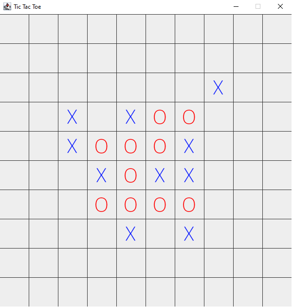

# Tic Tac Toe with Minmax AI




The traditional Tic-Tac-Toe or XO game which everyone knows about and played before :).
This version of the game is extending the standard version 3x3 with a bigger map and 
an AI which is using Mini-Max algorithm with Alpha-Beta pruning strategy for efficient, faster
 response time.

## Min-max algorithm with Alpha-Beta pruning
A description for the algorithm, assuming X is the "turn taking player," would look something like:

- If the game is over, return the score from X's perspective.
- Otherwise get a list of new game states for every possible move
- Create a scores list
- For each of these states add the minimax result of that state to the scores list
- If it's X's turn, return the maximum score from the scores list
- If it's O's turn, return the minimum score from the scores list

Main loop of the algorithm:
```
    private static int[] alphaBetaPruning(Board.State player, Board board, int alpha, int beta) {

        int score;
        int bestRow = -1;
        int bestCol = -1;

        if(board.isGameOver()) {
            System.out.println("EVALUATE");
            System.out.println(board.toString());
            score = evaluate(player,board);
            return new int[] {score, bestRow, bestCol};
        } else {
            for (Integer cellIndex : board.getAvailableMoves()) {

                Board modifiedBoard = board.getDeepCopy();
                modifiedBoard.move(cellIndex);

                if (board.getTurn() == player) {
                    score = alphaBetaPruning(player, modifiedBoard, alpha, beta)[0];
                    if (score > alpha) {
                        alpha = score;
                        bestRow = cellIndex / Board.BOARD_WIDTH;
                        bestCol = cellIndex % Board.BOARD_WIDTH;
                    }
                } else {
                    score = alphaBetaPruning(player, modifiedBoard, alpha, beta)[0];
                    if (score < beta) {
                        beta = score;
                        bestRow = cellIndex / Board.BOARD_WIDTH;
                        bestCol = cellIndex % Board.BOARD_WIDTH;
                    }
                }

                if (alpha >= beta) break;
            }
            return new int[] {board.getTurn() == player ? alpha : beta, bestRow, bestCol};
        }
    }
```

The evaluate method:

```
 private static int evaluate(Board.State player, Board board) {

        if (player == Board.State.Blank) {
            throw new IllegalArgumentException("Player must be X or O.");
        }

        Board.State opponent = (player == Board.State.X) ? Board.State.O : Board.State.X;

        int score;
        int rowscore;
        int columnscore;
        int diagonalscoretopright = 0;
        int diagonalscoretopleft = 0;

        rowscore = evaluateRows(board, player, opponent);
        columnscore = evaluateColumns(board, player, opponent);


        for(int row = Board.BOARD_WIDTH - Window.J; row > 0; row --) {
            int sright = evaluateDiagonalsFromTopRight(board, player, opponent, row, 0);
            int sleft = evaluateDiagonalFromTopLeft(board, player, opponent, row, Board.BOARD_WIDTH-1);

            diagonalscoretopright += sright;
            diagonalscoretopleft += sleft;
        }

        for(int column = 0; column <= Board.BOARD_WIDTH - Window.J; column ++) {
            int sright = evaluateDiagonalsFromTopRight(board, player, opponent, 0, column);
            int sleft = evaluateDiagonalFromTopLeft(board, player, opponent, 0, Board.BOARD_WIDTH-1 - column);

            diagonalscoretopright += sright;
            diagonalscoretopleft += sleft;

        }


        score = rowscore + columnscore + diagonalscoretopright + diagonalscoretopleft;
        return score;
    }
```

## Usage
Change Depth variable to increase or decrease the number of steps the AI can calculate ahead. 
```
static final int Depth = 3;
```
Change the K variable to increase or decrease the map size
```
    static final int K = 10;
```
Change the J variable to set the required number of uninterrupted X or O need to win the game
horizontally, vertically and diagonally.
```
    static final int J = 5;
```

Enjoy :)


